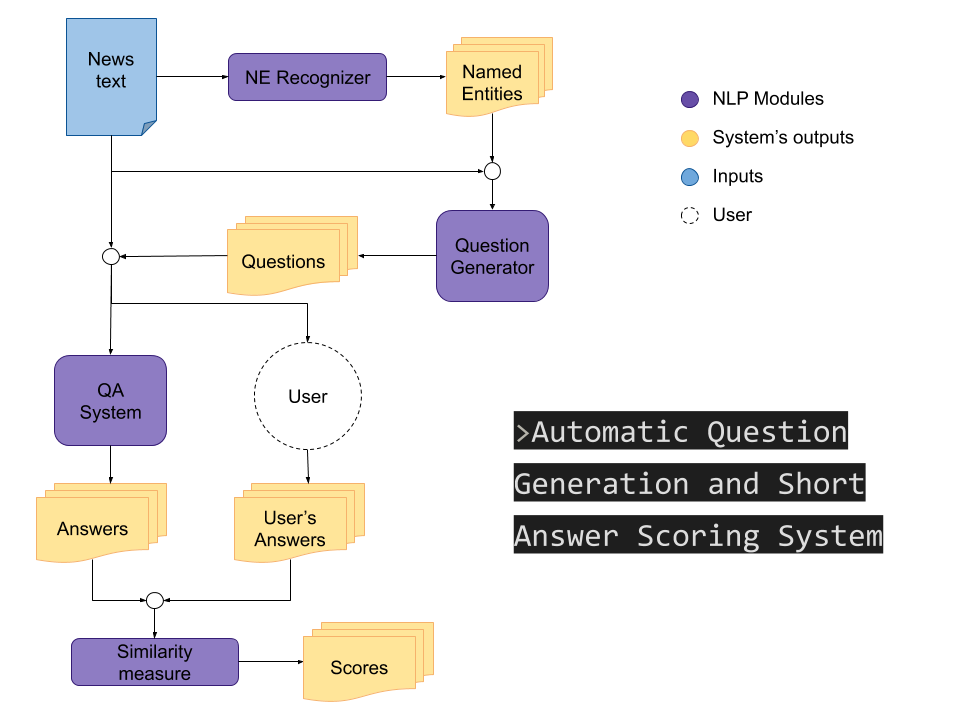

# Automatic Question Generation and Short Answer Scoring system



## Instalation

The first think you have to do is install the requirements. You can do it with the following command:

```bash
pip install -r requirements.txt
```

### Question Generation model

The model used on this application is the checkpoint provided by [UniLM](https://github.com/microsoft/unilm) that you can download from here: [here](https://drive.google.com/open?id=1JN2wnkSRotwUnJ_Z-AbWwoPdP53Gcfsn).

Once you downloaded the checkpoint create the `pretrained_models/` directory and save the checkpoint there.

## How to run

The `host` and `port` arguments are only necessary if you want to open a server through internet. If you want to just open the server for local usage skip those parameters.

### Linux
```bash
export FLASK_APP=server.py
flask run --host=YOUR_LOCAL_IP --port=PORT
```

### Windows
```powershell
$env:FLASK_APP = "server.py"
flask run --host=YOUR_LOCAL_IP --port=PORT
```

## Credits

This application is powered by the following resources:
* Transformers (🤗 [Huggingface](https://github.com/huggingface/transformers))
* Flair ([FlairNLP](https://github.com/flairNLP/flair))
* UniLM ([Microsoft](https://github.com/microsoft/unilm))
